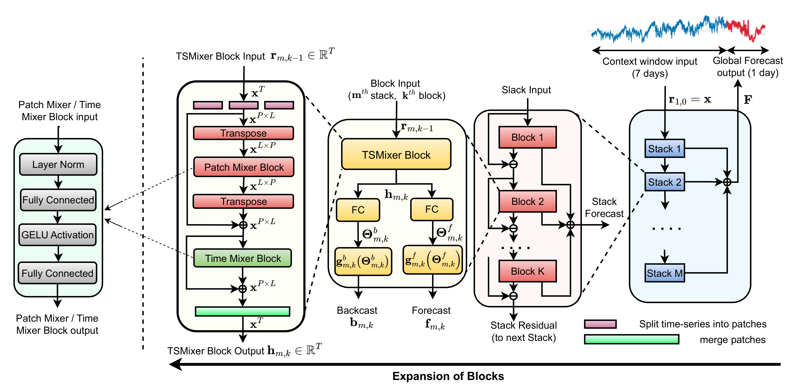
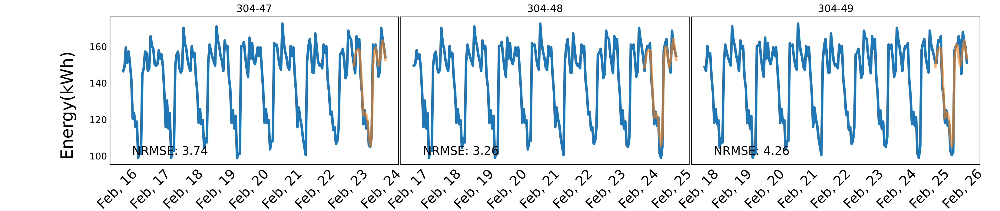
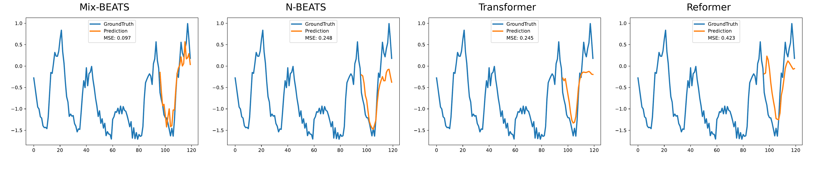

# Mix-BEATS: Mixer-enhanced Basis Expansion Analysis for Load Forecasting

This repository contains the official code for the paper:

**Mix-BEATS: Mixer-enhanced Basis Expansion Analysis for Load Forecasting**  
*Anuj Kumar, Harish Kumar Saravanan, Shivam Dwivedi, Pandarasamy Arjunan*  
*Robert Bosch Centre for Cyber Physical Systems, Indian Institute of Science, Bangalore*  
To appear in **ACM e-Energy 2025**, June 17, 2025, Rotterdam, Netherlands.

---
## 📄 Paper

[Mix-BEATS: Mixer-enhanced Basis Expansion Analysis for Load Forecasting (E-Energy ’25)](http://camps.aptaracorp.com/ACM_PMS/PMS/ACM/EENERGY25/49/65dd3077-2f5b-11f0-ada9-16bb50361d1f/OUT/eenergy25-49.html)

---

## 🧠 Overview

Mix-BEATS is a lightweight, hybrid model for short-term load forecasting that combines the residual learning of N-BEATS with the MLP-based patch and time mixing of TSMixer. Designed for efficiency and generalization, it achieves superior performance across diverse buildings while being suitable for edge deployment.

---

## Features

- **Hybrid Architecture Combining N-BEATS and TSMixer**  
  Leverages residual learning with patch and time mixing for efficient and accurate forecasting.

- **Mixer-based Temporal Modeling**  
  Applies MLP-based patch and time mixing operations inspired by vision transformers for effective time-series representation.

- **Basis Expansion Analysis**  
  Uses N-BEATS-style basis functions to improve interpretability and feature extraction.

- **Pretrained on Large-Scale, Real-World Smart Meter Data**  
  Trained on hourly consumption data from over 38,000 buildings to ensure robust generalization.

- **Lightweight and Edge-Deployable**  
  Optimized for computational efficiency, making it suitable for deployment in resource-constrained environments.

- **Comprehensive Benchmarking**  
  Evaluated against state-of-the-art time series foundation models and generic models in zero-shot, fine-tuned, and domain-specific scenarios.

- **Open and Reproducible**  
  Publicly available codebase with training, evaluation, and benchmarking scripts for easy replication and extension.

---
## 📊 Real-World Building Datasets

This project uses large-scale **real-world building energy datasets** from commercial and residential domains, collected from multiple countries.

| Dataset   | Location     | Type        | # Buildings | # Observations | Years       |
|-----------|--------------|-------------|-------------|----------------|-------------|
| IBlend    | India        | Commercial  | 9           | 296,357        | 2013–2017   |
| Enernoc   | USA          | Commercial  | 100         | 877,728        | 2012        |
| NEST      | Switzerland  | Residential | 1           | 34,715         | 2019–2023   |
| Ireland   | Ireland      | Residential | 20          | 174,398        | 2020        |
| MFRED     | USA          | Residential | 26          | 227,622        | 2019        |
| CEEW      | India        | Residential | 84          | 923,897        | 2019–2021   |
| SMART*    | USA          | Residential | 114         | 958,998        | 2016        |
| Prayas    | India        | Residential | 116         | 1,536,409      | 2018–2020   |
| NEEA      | USA          | Residential | 192         | 2,922,289      | 2018–2020   |
| SGSC      | Australia    | Residential | 13,735      | 172,277,213    | 2011–2014   |
| GoiEner   | Spain        | Residential | 25,559      | 632,313,933    | 2014–2022   |

**Total: 39,956 buildings and 812M+ hourly observations**

> ⚠️ These datasets are used under their respective terms/licenses for academic research only.

---

## 📚 Generic Benchmark Datasets

TSPulse is extensively evaluated on popular time-series forecasting benchmarks from domains such as energy, economics, traffic, weather, and disease surveillance.

| Dataset         | Variates | Timesteps | Granularity |
|------------------|----------|-----------|-------------|
| Weather          | 21       | 52,696    | 10 min      |
| Traffic          | 862      | 17,544    | 1 hour      |
| Electricity      | 321      | 26,304    | 1 hour      |
| ETTh1            | 7        | 17,420    | 1 hour      |
| ETTh2            | 7        | 17,420    | 1 hour      |
| ETTm1            | 7        | 69,680    | 15 min      |
| ETTm2            | 7        | 69,680    | 15 min      |
| Illness (ILI)    | 7        | 966       | 1 week      |
| Exchange-Rate    | 8        | 7,588     | 1 day       |

---

## 📈 Comparative Evaluation

We benchmark **Mix-BEATS** against state-of-the-art Time-Series Foundation Models (TSFMs) and generic data-specific baselines across two broad settings:

---

### 🔍 1. Comparison with Existing Time-Series Foundation Models (TSFMs)

**Mix-BEATS** was evaluated against top foundation models including **Moirai**, **Chronos**, **Lag-Llama** and **Tiny Time Mixers (TTMs)**.

#### 🏗️ Dataset and Evaluation Setup

- **Training Data**: 38,000 real-world building time-series from 11 datasets (see Real Building Datasets section).
- **Split Strategy**:
  - **80%** for training
  - **20%** for validation
  - **Test Set**: 1,000 unseen buildings, sampled evenly from all datasets to ensure generalization.
- **Evaluation**:
  - **Zero-shot**: Directly tested without task-specific fine-tuning.
  - **Fine-tuned**: Adapted using training split from the target dataset, without using test labels.

#### 📊 Results (Zero-Shot and Fine-Tune)

**Figure 1: Performance Comparison of TSFMs (Zero-Shot & Fine-Tuned)**  
_Mix-BEATS consistently outperforms larger models despite its small size (0.18M params)_

**NRMSE (Normalized Root Mean Square Error)** — Lower is better.  
Forecasting context length: **168 hours (7 days)**  
Forecast horizon: **24 hours (1 day)**

| Dataset  | Zero-shot Moirai | Chronos | Lag-Llama | TTMs | **Mix-BEATS** | Fine-tuned Moirai | Lag-Llama | **Mix-BEATS** |
|----------|------------------|---------|-----------|------|---------------|-------------------|-----------|----------------|
| Enernoc  | 29.93            | 26.72   | 52.41     | 23.94 | **23.27**     | 25.41             | 28.71     | **21.72**      |
| Iblend   | 28.03            | *16.90* | 63.89     | 22.24 | **20.31**     | 22.73             | **19.17** | *20.62*        |
| **Avg. (Top)** | 28.98      | *21.81* | 58.15     | 23.09 | **21.79**     | 24.07             | 23.94     | **21.17**      |
| Mathura  | **110.33**       | *103.51*| 114.22    | 136.79| 132.82        | **92.19**         | *100.07*  | 121.70         |
| Bareilly | 70.63            | 74.57   | 90.61     | *65.15* | **64.01**   | **55.14**         | 70.00     | *58.96*        |
| MFRED    | 27.83            | *26.12* | 62.70     | **25.47** | 25.12     | **21.53**         | 31.54     | *24.92*        |
| NEEA     | 81.13            | 83.37   | 92.66     | *70.04* | **69.25**   | **67.54**         | 85.00     | *70.79*        |
| NEST     | 72.43            | *72.06* | 85.73     | 65.03 | **65.44**     | **55.71**         | 67.63     | *51.27*        |
| Prayas   | 91.13            | *88.66* | 101.20    | 102.70| **100.90**    | **57.56**         | 78.76     | *71.64*        |
| Smart*   | *66.63*          | 70.42   | 84.34     | **62.27** | 60.74    | **65.87**         | 89.85     | *74.70*        |
| Ireland  | *87.23*          | 93.05   | 116.36    | **82.25** | 81.75    | **70.74**         | 83.57     | *77.36*        |
| GoiEner  | **112.35**       | *115.32*| 131.96    | 118.42| 119.00        | **100.07**        | 111.80    | *97.08*        |
| SGSC     | *92.74*          | 100.16  | 112.64    | **93.63** | 92.20     | **85.97**         | 89.96     | *83.42*        |
| **Avg. (All)** | **81.24**  | *82.72* | 99.24     | 82.18 | **81.12**     | **67.23**         | 80.82     | *73.18*        |

> **Note**:  
> - **Bold** = Best result  
> - *Italic/Underline* = Second-best result  
> - NRMSE values are lower-is-better, indicating better forecast accuracy.

---

### 🌐 2. Comparison with Generic Data-Specific Models

We also compare Mix-BEATS with popular models like **TSMixer**, **FedFormer**, **TimesNet**, and **Non-Stationary Transformers** on standard benchmark datasets across energy, weather, traffic, economics, and epidemiology domains.

#### 🧾 Datasets and Splits

- **ETT (ETTh1, ETTh2, ETTm1, ETTm2)**:  
  - 60% Training / 20% Validation / 20% Testing

- **Electricity, Traffic, Weather, Illness, Exchange-Rate**:  
  - 70% Training / 10% Validation / 20% Testing

#### 📊 Results on Forecasting Tasks

**Metric:** MSE (Mean Squared Error)  
**Context Length:** 96  
**Forecast Horizon:** 24  
**Lower is better** — **Bold = Best**, *Italic/Underline = Second-best*

| Dataset     | **Mix-BEATS** | N-BEATS | Autoformer | LightTS | TSMixer | Reformer | Transformer | TiDE | DLinear |
|-------------|---------------|---------|------------|---------|---------|----------|-------------|------|---------|
| **ETTh1**   | 0.040         | 0.063   | 0.062      | 0.057   | 0.057   | **0.031**| 0.057       | *0.043* | 0.033   |
| **ETTh2**   | *0.074*       | 0.075   | 0.090      | 0.086   | 0.075   | 0.079    | 0.090       | 0.083 | 0.076   |
| **ETTm1**   | *0.014*       | 0.017   | 0.020      | 0.018   | 0.016   | **0.011**| 0.016       | 0.015 | 0.012   |
| **ETTm2**   | **0.020**     | *0.021* | 0.039      | 0.027   | 0.023   | 0.024    | *0.021*     | 0.035 | 0.029   |
| **Electricity** | **0.211** | *0.202* | 0.347      | 0.250   | 0.206   | 0.256    | 0.223       | 0.361 | 0.312   |
| **Traffic** | **0.173**     | *0.179* | 0.274      | 0.323   | 0.239   | 0.183    | 0.150       | 0.341 | 0.330   |
| **Weather** | **0.001**     | *0.001* | 0.003      | 0.002   | *0.001* | *0.001*  | *0.001*     | *0.001* | 0.002   |
| **Exchange**| 0.043         | **0.035**| 0.057     | 0.053   | 0.048   | *0.035*  | 0.050       | 0.037 | 0.037   |

> ✅ **Note**: All values are MSE scores.  
> - **Bold** values indicate the best performance on a dataset.  
> - *Italic/underlined* values denote the second-best performance.  
> - Mix-BEATS demonstrates competitive or superior performance across nearly all datasets while maintaining efficiency.

---

## 🧠 Summary

TSPulse delivers:

- 📉 **Superior zero-shot performance**—even better than fine-tuned models in many cases.
- 🪶 **Extreme parameter efficiency**—outperforming models 10–100× larger.
- ⚙️ **Deployment-ready architecture**—ideal for edge, mobile, and CPU-constrained environments.

> 📁 Visualizations, training logs, and reproducible scripts for these experiments are included in the `/experiments/` and `/figures/` folders.

---

## 📣 Citation

If you use this code or ideas from our paper, please consider citing us. (BibTeX will be added after publication.)

---

## 📬 Contact

For any queries, please contact Pandarasamy Arjunan (samy@iisc.ac.in) or raise an issue in the repository.

---

